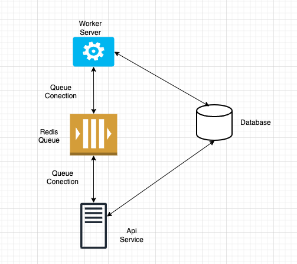

## To Do

- [ ] Create the logout endpoint
- [ ] Create the reset password endpoint
- [ ] Create the get JWT guard
- [ ] Create the method to say aware of new available trades
 
## Description

Backend side for the Pokemon project.

## Installation

```bash
$ yarn install
```

## Running the app
```bash
    cd backend
    yarn install
    ## Run the api service in a separate terminal
    cd backend
    yarn start:dev  api-service
    ## Run the worker service in a separate terminal
    cd backend
    yarn start:dev  worker-service
```

# Tecnologies used

Nestjs in monorepo mode with 2 apps: 
- api-service: The api service
- worker-service: The worker service

The worker service is a service that runs in the background, it is responsible for assigning pokemons to users, requesting trades, and giving pokemons.

The api service is the main service that handles the requests from the frontend.
and it is responsible for getting all the pokemons, getting the owned pokemons and other requests.



